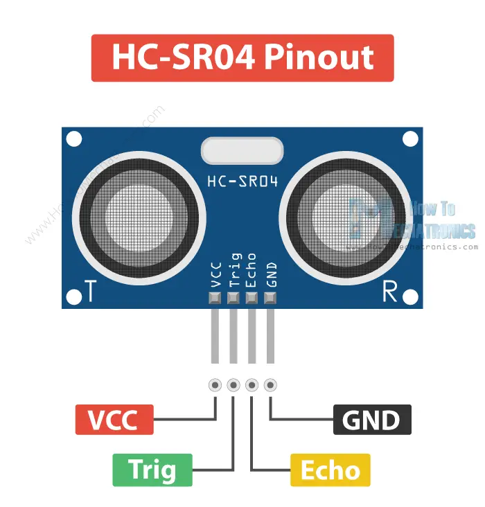
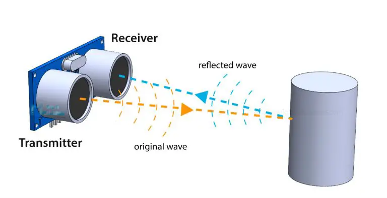

# HC-SR04 Ultrasonic Sensor
HC-SR04 is a sensor that uses ultrasonic echo phenomenon.
We are using it to detect objects in spesific distances.

## HC-SR04 Pinout Diagram

This sensor has 4 pins. Each of them described as follows:
|Pin |Description|
|:--:|:---------:|
|VCC |Pin for power supply. We can connect it to 5v or 3v power supply|
|GND |Ground connection. We can connect it to ground pin|
|Trig|Pin for triggering ultrasonic sound. When it triggers, Sensor sends ultrasonic wave|
|Echo|Pin for listening echo. After sending ultrasonic wave, sensor listens the wave that it send. When wave came back, that pin will be at high voltage|

||
|:--------------------------------------------------------------------------:|
|                     demonstration for how sensor works                     |

## Code Previews
First things first, we need to send a wave to listen. Because of that, we need
to send signal to the `Trig` pin.
We need to invoke `Trig` pin for a while. I invoked it for 10 microseconds.
It should not be that long. Simple, short wave will be enough for us.
So we need to create a function as follows:
```c++
void ping(){
  digitalWrite(PIN_DS_TRGR, HIGH);
  delayMicroseconds(10);
  digitalWrite(PIN_DS_TRGR, LOW);
}
```

And then, we need to listen the echo.
We can listen spesific pins for spesific states with this function named
[pulseIn](https://www.arduino.cc/reference/en/language/functions/advanced-io/pulsein/).
That function returns us unsigned long value that indicates how many time in
microseconds passed until our pin reached to the state that we want.

For example:
```c++
unsigned long echoTimeMs = pulseIn(PIN_DS_ECHO, HIGH);
```
Here, we want to listen pin called `PIN_DS_ECHO` which is indicates our
`Echo` pin in sensor. We want the signal of our pin to be `HIGH`. Because when
echo detected, state of `PIN_DS_ECHO` pin will be `HIGH`. So, we need to calculate
the time between sending signal and receiving it.

After getting the time, we can simply calculate the distance between sensor and
object now.

We just need to divide our time value to spesific value.
That value simply is `34 * 2`. Why is that?
The answer is simple too. Under normal circumstances, the speed of sound is `340 m/s`
that makes 34 centimeters per microsecond. So, we need to divide it by 34 in
order to calculate how many centimeter that wave went. And then, we need to divide
it by `2` because we don't want to calculate the distance of wave both for
outgoing and incoming.

You can check the code for more details. Thanks :)